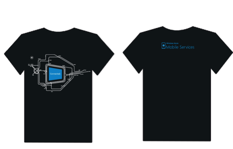
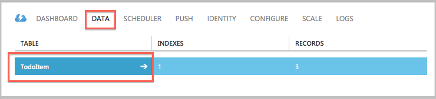

# Xamarin and Azure Mobile Services Challenge

### The Challenge

Integration with VS2013 makes it remarkably easy to get started building connected iOS and Android apps in C# with Xamarin and Azure Mobile Services.  

In this challenge, you will use Windows Azure Mobile Services & Xamarin to build a an iOS app in C#. The best part is that you'll be able to reuse most of this code in an Android app later. 

<b>Once you complete the challenge, swing by the Xamarin booth to pick up your t-shirt and enter into a raffle for a Jawbone Big Jambox.  We're giving one out at every stop.</b>

You'll login to the Windows Azure portal, create a new Mobile Service and SQL database.  Then, you'll download the sample ToDo list app and have some fun storing data in the cloud, configuring Facebook authentication, and sending push notifications.

The walkthrough below should help you with the challenge, but you can also get in touch with @JamesMontemagno and @ChrisNTR at the booth or @PaulBatum via Twitter with any questions!

####Bonus Challenge
For bonus points--obtain a free SendGrid account from the Windows Azure Store and send an email from scheduled scripts. Completing the bonus challenge will get you another entry in the Big Jambox raffle.

###Validation…and Prizes!

You can get these challenges validated by James or Chris until the end of the day.  This should only take 15 minutes to complete, so get started!

Everyone who completes the challenge earns the Mobile Services t-shirt below and one entry in the raffle for a Jawbone Big Jambox.  Those who complete the bonus challenge earn two entries in the Jambox raffle.



### Challenge Walkthrough

####Data

* To get started,either sign up for the [30-day free trial](http://www.windowsazure.com/en-us/pricing/free-trial/?WT.mc_id=azurebg_us_pmm_mirluna_azureorl) or [login to your existing Windows Azure account](http://www.windowsazure.com/en-us/pricing/free-trial/?WT.mc_id=azurebg_us_pmm_mirluna_azureorl).  
<b>If you're an MSDN subscriber, you can receive up to $150 in Azure credits each month--claim those [here](http://www.windowsazure.com/en-us/pricing/free-trial/?WT.mc_id=azurebg_us_pmm_mirluna_azureorl).</b>

* Click New --> Compute --> Mobile Service --> Create.  Then specify URL and database login/password order to create a new Mobile Service and the associated SQL database.


* Select your new mobile service, choose Xamarin.iOS and 'Create a New Xamarin App.'


* Make sure you have Xamarin installed, then click 'Create ToDoItem Table' and download the sample app.  This will automatically create a table called 'ToDoItem' in your app's SQL database and connect your sample client app to that table.


* Open the sample app in Visual Studio and run the app.  In the simulator, you'll be able to add items to the Todo list.  Add a few items. When you hit the (+) button, you're sending a POST your app's Mobile Services backend hosted in Windows Azure.


* If you head back to the [Windows Azure Portal](manage.windowsazure.com), you'll see that items that you added to the list are now stored in the TodoItem table in your SQL database.



* When you drill down into the 'TodoItem' table under the 'DATA' tab in the portal, you'll see the items you entered in a table with three columns.  Next, we're going to click the script table and copy the following code snippet into the 'Insert' operation to see how dynamic schemas work in Mobile Services.


Scripts are how you add some custom logic to your app, connect to other Windows Azure services, or work with third party APIs.  With Mobile Services, all your server scripts need to be written in JavaScript.

```
function insert(item, user, request) {

    item.created = new Date();

    request.execute();

}
```

* Here, we've walked through using a SQL database with your Mobile Service, but some apps need to store unstructured binary or typed data. Using scripts, you could easily connect to Windows Azure Blob or Table Storage (as well as many other third party data options). 

For more on scripts and data in Mobile Services, see [this tutorial](http://www.windowsazure.com/en-us/develop/mobile/tutorials/authorize-users-in-scripts-xamarin-ios/). 

####User Authentication

* The next step is to get set up with Facebook authentication and limit access to authenticated users.  

* In the Management Portal, click the Data tab, and then click the TodoItem table.


* Click the Permissions tab, set all permissions to 'Only Authenticated Users,' and then click Save. This will ensure that all operations against the TodoItem table require an authenticated user. This also simplifies the scripts in the next tutorial because they will not have to allow for the possibility of anonymous users.


* Follow the steps on [this page](http://www.windowsazure.com/en-us/develop/mobile/how-to-guides/register-for-facebook-authentication/) to register your app for Facebook authentication with Mobile Services.

* Copy over your App Key and Secret from Facebook into the appropriate slots in the 'IDENTITY' tab. Hit 'Save.'


* Back in Xcode, open the TodoService project file and add the following variables:

```
// Mobile Service logged in user
private MobileServiceUser user;
public MobileServiceUser User { get { return user; } }
```

* Add the following method to TodoService:

```
private async Task Authenticate(UIViewController view)
{
    try
    {
        user = await client.LoginAsync(view, MobileServiceAuthenticationProvider.Facebook);
    }
    catch (Exception ex)
    {
        Console.Error.WriteLine (@"ERROR - AUTHENTICATION FAILED {0}", ex.Message);
    }
}

```

* Move the request for the TodoItem table from TodoService into a new method called CreateTable: 

```
private async Task CreateTable()
{
    // Create an MSTable instance to allow us to work with the TodoItem table
    todoTable = client.GetTable<TodoItem>();
}
```

* Create a new asynchronous public method called LoginAndGetData

```
public async Task LoginAndGetData(UIViewController view)
{
    await Authenticate(view);
    await CreateTable();
}
```

* In the TodoListViewController, override  the ViewDidAppear method and define it as: 
```
public override async void ViewDidAppear(bool animated)
{
    base.ViewDidAppear(animated);


if (TodoService.DefaultService.User == null)
{
    await TodoService.DefaultService.LoginAndGetData(this);
}


if (TodoService.DefaultService.User == null)
{
    // TODO:: show error
    return;
} 


RefreshAsync();


}
```

* Remove the original call to RefreshAsync from TodoListViewController.ViewDidLoad and hit Run to build the project. You'll be presented with the Facebook login screen.

#####Bonus Challenge #1 Walkthrough

* The Windows Azure Store contains services and data sets that can be useful in your app.

* Click New --> Store --> SendGrid --> Free.

* Select ChosenSendGridName from the Dashboard and then hit 'Connection Info' and copy that information to your Notepad.

* Navigate to your Mobile service then click 'DATA' --> the 'ToDoItem' table --> 'SCRIPT.'

* On the 'Insert' script, replace the Insert function with the below code in order to trigger an email each time a new item is inserted to the 'ToDoItem' table.

```js
var SendGrid = require('sendgrid').SendGrid;


function insert(item, user, request) {    
    request.execute({
        success: function() {
            // After the record has been inserted, send the response immediately to the client
            request.respond();
            // Send the email in the background
            sendEmail(item);
        }
    });


function sendEmail(item) {
    var sendgrid = new SendGrid('**username**', '**password**');       

    sendgrid.send({
        to: '**email-address**',
        from: '**from-address**',
        subject: 'New to-do item',
        text: 'A new to-do was added: ' + item.text
    }, function(success, message) {
        // If the email failed to send, log it as an error so we can investigate
        if (!success) {
            console.error(message);
        }
    });
}
```


###Resources:

* Xamarin.Android Getting Started Content: 
http://www.windowsazure.com/en-us/develop/mobile/tutorials/get-started-xamarin-android
* Xamarin.iOS Getting Started with Push: http://www.windowsazure.com/en-us/develop/mobile/tutorials/get-started-with-push-xamarin-ios
* Xamarin.Android Getting Started with Push: http://www.windowsazure.com/en-us/develop/mobile/tutorials/get-started-with-push-xamarin-android
* Mobile Dev Center: www.windowsazure.com/mobile
* Collection of helpful blog posts & tutorials: aka.ms/CommonWAMS
* Forum: http://social.msdn.microsoft.com/Forums/en-US/azuremobile/threads
* Feature Requests: mobileservices.uservoice.com
* Feedback: mobileservices (at) microsoft (dot) com